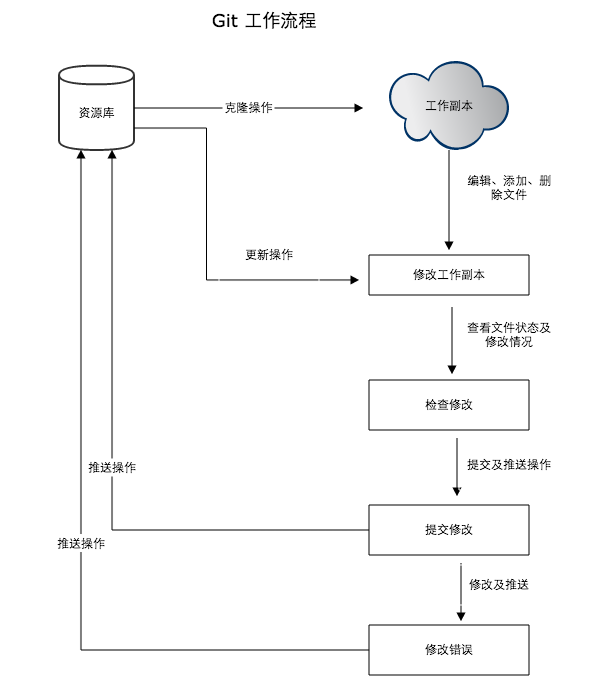
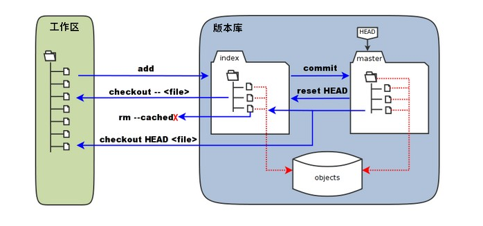

# Git工作流程
+ 克隆Git资源作为工作流程
+ 在克隆的资源上添加或修改问文件
+ 如果其他人修改了，你可以更新资源
+ 在提交前查看修改
+ 提交修改
+ 在修改完成后，如果发现错误，可以撤回提交并再次修改并提交


# Git工作区、暂存区和版本库
+ **工作区**：就是你电脑里能看到的目录
+ **暂存区**：英文叫stage或index。一般存放在“git目录”的index文件（.git/index）中，所以我们把暂存区也叫做索引（index）
+ **版本库**：工作区有一个隐藏目录“.git”，这个不算工作区，而是git的版本库

下面一张图展示了工作区、版本库中的暂存区和版本库之间的关系：


图中左侧为工作区，右侧为版本库。在版本库中标记为`index`的区域是暂存区，标记为`master`的是master分支所代表的目录树。
图中我们可以看出此时`HEAD`实际上是指向master分支的一个“游标”。所以图示的命令中出现HEAD的地方可以用master来替换。
图中`objects`标识的区域是Git的对象库，实际位于“.git\objects”目录下，里面包含了创建的各种对象及内容。

+ 当对工作区修改（或新增）的文件执行`git add`命令时，暂存区的目录树被更新，同时工作区修改（或新增）的文件内容被写入到对象库中的一个新的对象中，而该对象的ID被记录在暂存区的文件索引中。
+ 当执行提交操作`git commit`时，暂存区的目录树写到版本库（对象库）中，master分支会做相应的更新。即master指向的目录树就是提交时暂存区的目录树。
+ 当执行`git reset HEAD`命令时，暂存区的目录树会被重写，被master分支指向的目录树所替换，但是工作区不受影响。
+ 当执行`git rm --cached <file>`命令时，会直接从暂存区删除文件，工作区不做改变。
+ 当执行`git checkout .`或`git check -- <file>`命令时，会用暂存区全部或指定的文件替换工作区的文件。这个操作很危险，会清除工作区中未添加到暂存区的改动。
+ 当执行`git checkout HEAD .`或`git checkout HEAD <file>`命令时，会用HEAD指向的master分支中的全部内容或者部分内容替换暂存区和工作区的内容。这个命令非常危险，它不但会清除工作区中未提交的改动，也会清除暂存区中未提交的改动。


# Git学习笔记


## 创建ssh key
```bash
git config --global user.name "xxy"
git config --global user.email 775415344@qq.com

# 本地Git仓库与Github仓库之间的传输是通过SSH加密的，需要配置验证信息
# 生成SSH Key
ssh-keygen -t rsa -C "775415344@qq.com"
# 三次回车

# 查看秘钥
cd ~/.ssh
cat id_rsa.pub
# 复制秘钥
# 打开Github网站进行登录
# 到个人设置页Personal Settings
# 找到SSH and GPG keys
# 选择新建SSH key：new ssh key
# 填写和粘贴公钥内（不含中文）
```

# 1. 创建git项目

## 克隆远程版本库
```bash
git clone git@github.com:aixingxy/gitlearning.git  # 会自动创建master分支

# 如果想在克隆远程仓库的时候，自定义本地仓库的名字，可以使用如下命令
git clone git@github.com:atommutou/gitlearning.git my_repp
```
## 新建项目提交到远程库
```bash
mkdir gitlearning
cd gitlearning
echo "# gitlearning" >> README.md
git init
git add README.md
git commit -m "first commit"
git remote add origin git@github.com:atommutou/gitlearning.git
git push -u origin master
# 第一次推送master分支，加上-u参数，Git不但会把本地的master分支内容推送的远程新的master，还把本地master分支和远程的master分支关联起来。
# 以后推送，使用下面的语句就可以了
git push origin master
```

## 更新提交到仓库
工作目录下的每一个文件都不外乎两种状态：`已跟踪`和`未跟踪`。
- 已跟踪是指那些被纳入了版本控制的文件，在上一次快照中有它们的记录没在工作一段时间后，它们的状态可能处于未修改，已修改或已放入暂存区。
- 工作目录中除了已跟踪文件以外的所有其他文件都属于未跟踪文件，它们既不存在于上次快照的记录中，也没有放入暂存区。
- 初次clone某个仓库的时候，工作目录中的所有文件都属于已跟踪文件，并处于未修改状态。

### git add的功能
```bash
git add file  # 添加制定文件
git add .  # 添加工程下的所有文件
```
- 可以用来开始跟踪新文件
- 把已跟踪的文件放到暂存区
- 合并时把有冲突的文件标记为已解决的状态

### git status查看状态
```
git status  # 
git status -s  # 加上-s参数，以获得简短的输出结果 
```

### git diff查看git status结果的详细信息
```bash
git diff  # 查看尚未缓存的改动
git diff --cached  # 查看已缓存的改动
git diff HEAD  # 查看已缓存与未缓存的所有改动
```
# 2.远程仓库

## 添加远程库
```
git remote add [shortname] [url]
```

## 查看当前配置的远程库
```
git remote
git remote -v  # 执行时加上 -v 参数，可以看到每个别名的实际链接地址。

➜  gitlearning git:(master) ✗ git remote
origin
➜  gitlearning git:(master) ✗ git remote -v
origin	git@github.com:atommutou/gitlearning.git (fetch)
origin	git@github.com:atommutou/gitlearning.git (push)
```

## 提取远程仓库
Git 有两个命令来提取远程仓库的更新

1. 从远程仓库下载新分支与数据
```
git fetch 远程库

# 1. 在Github上手动修改一个文件

# 2. 获取没有的数据
➜  gitlearning git:(master) git fetch origin
remote: Counting objects: 3, done.
remote: Compressing objects: 100% (2/2), done.
remote: Total 3 (delta 0), reused 0 (delta 0), pack-reused 0
Unpacking objects: 100% (3/3), done.
From github.com:atommutou/gitlearning
   b5c8d2f..242cdeb  master     -> origin/master

# 3. 将Github上的任何更新合并到你的当前分支
➜  gitlearning git:(master) git merge origin/master
Updating 8081b74..242cdeb
Fast-forward
 Readme.md | 2 +-
 1 file changed, 1 insertion(+), 1 deletion(-)
➜  gitlearning git:(master) cat Readme.md
# README
# online change
```
该命令执行完后需要执行`git merge 远程分支`到你所在的分支

2. 从远端仓库提取数据并尝试合并到当前分支
```
git pull
```
该命令技术执行`git fetch`之后紧接着执行`git merge 远程分支`到你所在的任意分支。

## 推送到远程仓库
```
git push [alias] [branch]  # 将本地的[branch]分支推送到[alias]远程仓库上的[branch]分支
```
## 删除远程仓库
```
git remote rm [alias]

➜  gitlearning git:(master) git remote
origin
➜  gitlearning git:(master) ✗ git remote -v
origin	git@github.com:atommutou/gitlearning.git (fetch)
origin	git@github.com:atommutou/gitlearning.git (push)
➜  gitlearning git:(master) ✗ git remote add origin2 git@github.com:atommutou/gitlearning.git
➜  gitlearning git:(master) ✗ git remote -v
origin	git@github.com:atommutou/gitlearning.git (fetch)
origin	git@github.com:atommutou/gitlearning.git (push)
origin2	git@github.com:atommutou/gitlearning.git (fetch)
origin2	git@github.com:atommutou/gitlearning.git (push)
➜  gitlearning git:(master) ✗ git remote rm origin2
➜  gitlearning git:(master) ✗ git remote -v
origin	git@github.com:atommutou/gitlearning.git (fetch)
origin	git@github.com:atommutou/gitlearning.git (push)
```

# 3. 分支操作
## 创建分支
```bash
git checkout -b dev  # 创建分支并直接切换
# 相当于下面两个句子
git branch dev  # 创建分支
git checkout dev  # 切换分支
```

## 查看分支
```bash
git branch  # 当前分支钱前面会有一个*号，当你执行gi他init时，缺省情况下会自动创建master分支
git branck -a  # 查看所有分支
```

## 切换分支
```bash
git checkout dev
```

## 合并分支
```bash
git merge dev  # 用于合并指定分支到当前分支
# 使用Fast-forward

# 例子
➜  gitlearning git:(master) ✗ touch Readme.md
➜  gitlearning git:(master) ✗ echo "# README" > Readme.md
➜  gitlearning git:(master) ✗ cat Readme.md
# README
➜  gitlearning git:(master) ✗ git add .
➜  gitlearning git:(master) ✗ git commit -m "update"
[master ee32b3d] update
 2 files changed, 3 insertions(+), 1 deletion(-)
 create mode 100644 Readme.md
➜  gitlearning git:(master) git branch dev
➜  gitlearning git:(master) git checkout dev
Switched to branch 'dev'
➜  gitlearning git:(dev) ls
Readme.md        git_note_book.md img
➜  gitlearning git:(dev) echo "# add line by dev" >> Readme.md
➜  gitlearning git:(dev) ✗ cat Readme.md
# README
# add line by dev
➜  gitlearning git:(dev) ✗ git add .
➜  gitlearning git:(dev) ✗ git commit -m "update by dev"
[dev 47d8a11] update by dev
 1 file changed, 1 insertion(+)
➜  gitlearning git:(dev) git status -s
➜  gitlearning git:(dev) git checkout master
Switched to branch 'master'
Your branch is ahead of 'origin/master' by 2 commits.
  (use "git push" to publish your local commits)
➜  gitlearning git:(master) echo "# add by master" >> Readme.md
➜  gitlearning git:(master) ✗ cat Readme.md
# README
# add by master
➜  gitlearning git:(master) ✗ git add .
➜  gitlearning git:(master) ✗ git commit -m "update by master"
[master 185a544] update by master
 1 file changed, 1 insertion(+)
➜  gitlearning git:(master) git merge dev
Auto-merging Readme.md
CONFLICT (content): Merge conflict in Readme.md
Automatic merge failed; fix conflicts and then commit the result.
➜  gitlearning git:(master) ✗ cat Readme.md
# README
<<<<<<< HEAD
# add by master
=======
# add line by dev
>>>>>>> dev
➜  gitlearning git:(master) ✗ vim Readme.md
➜  gitlearning git:(master) ✗ git add .
➜  gitlearning git:(master) git commit -m "merge dev"
[master 06c20e3] merge dev
➜  gitlearning git:(master) git branch -d dev
Deleted branch dev (was 47d8a11).
➜  gitlearning git:(master) git branch
```

## 查看分支合并情况
```bash
git log --graph --pretty=oneline --abbrev-commit
```

## 切换远程分支
```bash
git branch -a # 列出所有分支名称
# remotes/origin/dev
# remotes/origin/release
git checkout -b dev origin/dev  # checkout远程的dev分支，在本地起名为dev分支，并切换到本地的dev分支
git checkout -b release origin/release
git checkout dev  # 直接切换远程分支
```

## 删除分支
```bash
git branch -d dev  # 将分支合并后使用-d参数进行删除
git branch -D dev  # 若分支还未合并则使用-D参数进行删除
```
# 4. 查看历史
## git log
```
git log  # 列出历史提交记录
git log --oneline  # --oneline选项，查看历史记录的简洁的版本
git log --onelien --graph  # --graph 选项，查看历史中什么时候出现了分支、合并
git log --reverse --oneline  # --reverse参数来逆向显示所有日志
git log --author=Linus --oneline -5  # 查找指定用户的提交日志
git log --decorate  # 我们可以查看标签信息
```

## git 标签
```
git tag -a v1.0  # -a 选项意为"创建一个带注解的标签"。 不用 -a 选项也可以执行的，但它不会记录这标签是啥时候打的，谁打的，也不会让你添加个标签的注解。 我推荐一直创建带注解的标签。
# 查看标签信息
git log --oneline --decorate --graph  

# 如果我们忘了给某个提交打标签，又将它发布了，我们可以给它追加标签
git tag -a v0.9 85fc7e7

git tag  # 查看标签
```

# 5. 后悔操作
## 版本回退
在Git中，用HEAD表示当前版本，上一个版本就是HEAD^，上上个版本就是HEAD^^，上100个版本HEAD~100

```bash
# 使用--hard强制恢复到某次提交，并且git log中也不会显示上一次的提交
git reset --hard HEAD^
```
如果希望再次回到最新提交，可以通过git reflog查看每一条记录，来寻找commit_id,再使用
```bash
git reset --hard commit_id
```
## 丢弃工作区的修改
```bash
git checkout -- <file>  #会用暂存区指定的文件替换工作区的文件
git checkout .  #会用暂存区全部文件替换工作区的文件
```

场景1：当你改乱了工作区某个文件的内容，想直接丢弃工作区的修改时，用命令```git checkout -- file```

场景2：当你不但改乱了工作区某个文件的内容，还添加到了暂存区时，想丢弃修改，分两步，第一步用命令```git reset HEAD file```，就回到了场景1，第二步按场景1操作。

场景3：已经提交了不合适的修改到版本库时，想要撤销本次提交，参考版本回退一节，不过前提是没有推送到远程库

## 撤销commit
场景：当你commit之后，发现自己忘记提交一些文件，又不想再创建一个commit，可以撤销上一次的提交``git commit --amend "new description"`，然后再add遗漏的文件到缓存区，再提交，确认提交之后，便可以将本地仓库的文件提交到远程仓库中，即`git push origin 仓库名`

# 6.其他命令

## 跳过使用暂存区
```bash
git commit -a "描述" #自动把所有已经跟踪的过的文件暂存起来并一并提交
```

## 比较远程库与本地的区别
```bash
git fetch origin
git diff master origin/master
```
## 删除文件
```bash
# 对于已经add到暂存区的文件，可以使用下面的方法进行删除
git rm -f <file> # 将文件从缓存区和硬盘中（工作目录）中删除，如果要在工作目录中保留改文件，可以使用
git rm --cached <file>  # 将文件从缓存区中删除，但是保留在工作目录中

➜  gitlearning git:(master) touch a.py
➜  gitlearning git:(master) ✗ ls
a.py             git_note_book.md img
➜  gitlearning git:(master) ✗ git add a.py
➜  gitlearning git:(master) ✗ git rm a.py
error: the following file has changes staged in the index:
    a.py
(use --cached to keep the file, or -f to force removal)
➜  gitlearning git:(master) ✗ git rm --cached a.py
rm 'a.py'
➜  gitlearning git:(master) ✗ ls
a.py             git_note_book.md img
➜  gitlearning git:(master) ✗ git status -s
 M git_note_book.md
?? a.py
➜  gitlearning git:(master) ✗ git add .
➜  gitlearning git:(master) ✗ git status -s
A  a.py
M  git_note_book.md
➜  gitlearning git:(master) ✗ git rm -f a.py
rm 'a.py'
➜  gitlearning git:(master) ✗ ls
git_note_book.md img
➜  gitlearning git:(master) ✗ git status -s
M  git_note_book.md

# 对于已经commit的文件
git rm <file>  # 会将文件从缓存区和你的硬盘中（工作目录）删除

➜  gitlearning git:(master) ✗ git add .
➜  gitlearning git:(master) ✗ git status
On branch master
Your branch is up to date with 'origin/master'.

Changes to be committed:
  (use "git reset HEAD <file>..." to unstage)

	new file:   a.py

➜  gitlearning git:(master) ✗ git commit -m "update"
[master c2ae4fc] update
 1 file changed, 0 insertions(+), 0 deletions(-)
 create mode 100644 a.py
➜  gitlearning git:(master) git push origin master
Counting objects: 3, done.
Delta compression using up to 8 threads.
Compressing objects: 100% (2/2), done.
Writing objects: 100% (3/3), 303 bytes | 303.00 KiB/s, done.
Total 3 (delta 0), reused 1 (delta 0)
remote: This repository moved. Please use the new location:
remote:   git@github.com:aixingxy/git_learning.git
To github.com:atommutou/gitlearning.git
   86eb681..c2ae4fc  master -> master
➜  gitlearning git:(master) git status
On branch master
Your branch is up to date with 'origin/master'.

nothing to commit, working tree clean
➜  gitlearning git:(master) git rm a.py
rm 'a.py'
➜  gitlearning git:(master) ✗ ls
git_note_book.md img
➜  gitlearning git:(master) ✗ git status -s
D  a.py
# 而 git rm --cached <file>  # 将文件从版本库和暂存区中删除，但是保留在工作目录中
# 总结：git rm --cached file # 不论文件是已经暂存还是已经提交，用这个方法都能删掉，且不会删掉物理文件
```
## 查看日志
```bash
git log
git log -p # 显示每次提交内容的差异
git log -2 # 显示最近两次提交
git log --stat # 显示每次提交的简短统计信息
```
## 查看日志详细信息
```bash
# 现根据git log查看提交ID，然后使用下面的句子，查看详细的提交信息
git show commit_id
```

## 查看远程仓库
```bash
git remote  # 列出每一个指定的远程仓库服务器
git remote -v  # 会显示远程仓库和URL
```
## 从远程仓库中抓取与拉取
这个命令会访问远程仓库，从中拉取所有还没有的数据。执行完成以后，将会拥有那个远程仓库中所有分支的引用，可以随时合并或查看
注意

`git fetch` 命令会将数据拉取到本地，它并不会合并会修改当前的工作。必须手动将其并入你的工作区。

`git pull` 命令会从最初克隆的服务器上抓取数据并走动尝试合并到当前所在的分支。

`git clone` 命令会自动设置本地master分支跟踪克隆的远程的master分支。

## 推送到远程仓库
```bash
# 将master分支推送到origin服务器上时（克隆时会自动帮你设置好两个名字），使用下面这个命令
git push origin master
```
当你和其他人在同一时间克隆，他们先推送到上游然后你再推送到上游，你的推送将毫无疑问地被拒绝。你必须先将他们的工作拉取下来并将其合并到你的工作后才能推送。

## 查看远程库
```bash
git remote show origin
```

## 远程仓库的移除与重命名
```bash
# 将gs重命名为newgs
git remote rename gs newgs # 注意这将修改你的远程分支的名字
# 将newgs删除
git remote rm newgs
```
## Git隐藏(stash)操作
- 你正在写代码，突然出现一个紧急bug要修复，你既不能提交代码，也不能丢弃当前的代码，你可以使用`git stash`将当前工作隐藏起来，存放到堆栈上。
- 通过`git stash list`命令查看已存在更改的列表。
- 通过`git stash pop`命令从堆栈中删除更改并将其放置在当前的工作目录中。

## 移动文件
```bash
git mv file dir/ # 将文件移动到dir文件下，之后再提交
```


## 冲突文件格式
```txt
<=====
//冲突，自己
======
//冲突，他人
====>
```


# 程序开发流程
1.比如说master分支是生产环境的代码，每次开发前我会先pull一下最新的master的代码，然后checkout出来一个新的分支，比如说dev分支`git checkout -b dev`

2.然后新代码都会写在dev分支上，开发测试完成后，add，commit。

3.然后checkout回master分支`git checkout master`，git pull最新的master代码。

4.与自己的dev分支进行diff操作看看，都有什么地方不同（主要是看，除了自己修改的，还有什么）
```bash
# linux的重定向命令
git diff [branchA] [branchB] > a.txt  # > 表示覆盖
git diff [branchA] [branchB] >> a.txt  # >> 表示追加
```
5.再`git merge dev`分支进行合并，在master分支下`git push origin master`

6.新手经常出现的版本冲突通常是大家同时修改了同一模块的东西。

# Git服务器搭建
参考： https://www.w3cschool.cn/git/git-server.html
上一章节中我们远程仓库使用了 Github，Github 公开的项目是免费的，但是如果你不想让其他人看到你的项目就需要收费。

这时我们就需要自己搭建一台Git服务器作为私有仓库使用。

接下来我们将以 Centos 为例搭建 Git 服务器。

### 1、安装Git

`$ yum install curl-devel expat-devel gettext-devel openssl-devel zlib-devel perl-devel`
`$ yum install git` 

接下来我们 创建一个git用户组和用户，用来运行git服务：

`$ groupadd git`
`$ adduser git -g git` 

### 2、创建证书登录

收集所有需要登录的用户的公钥，公钥位于id_rsa.pub文件中，把我们的公钥导入到/home/git/.ssh/authorized_keys文件里，一行一个。

如果没有该文件创建它：

`$ cd /home/git/`
`$ mkdir .ssh`
`$ chmod 700 .ssh`
`$ touch .ssh/authorized_keys`
`$ chmod 600 .ssh/authorized_keys` 

### 3、初始化Git仓库

首先我们选定一个目录作为Git仓库，假定是/home/gitrepo/w3cschoolcn.git，在/home/gitrepo目录下输入命令：

`$ cd /home`
`$ mkdir gitrepo`
`$ chown git:git gitrepo/`
`$ cd gitrepo`

`$ git init --bare w3cschoolcn.git`
`Initialized empty Git repository in /home/gitrepo/w3cschoolcn.git/` 

以上命令Git创建一个空仓库，服务器上的Git仓库通常都以.git结尾。然后，把仓库所属用户改为git：

`$ chown -R git:git w3cschoolcn.git` 

### 4、克隆仓库

`$ git clone git@192.168.45.4:/home/gitrepo/w3cschoolcn.git`
`Cloning into 'w3cschoolcn'...`
`warning: You appear to have cloned an empty repository.`
`Checking connectivity... done.` 

192.168.45.4 为 Git 所在服务器 ip ，你需要将其修改为你自己的 Git 服务 ip。

这样我们的 Git 服务器安装就完成了，接下来我们可以禁用 git 用户通过shell登录，可以通过编辑/etc/passwd文件完成。找到类似下面的一行：

`git:x:503:503::/home/git:/bin/bash` 

改为：

`git:x:503:503::/home/git:/sbin/nologin`
